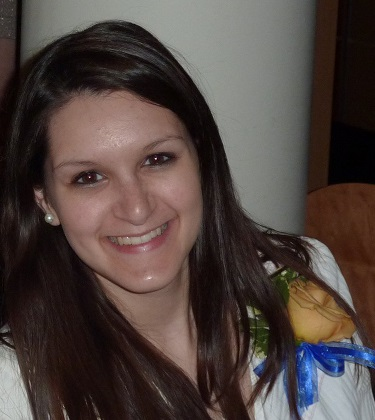

{:.avatar}

# Asha Noonan
Hybrid Mobile App Development Student and Technology aficionado

<a href="mailto:">asha.nair.noonan@gmail.com</a>
|
<i class="fa fa-github"></i> <a href="http://github.com/">anoonan3805</a>
|
<i class="fa fa-twitter"></i> <a href="http://twitter.com/">AshaErin</a>

## Currently

I'm a student at Softstack Factory, due to finish around September 2016. I have eight years of experience in the non-profit and education sectors. Supervisory experience as well as strong collaboration and communication skills. Specialized study and background in mobile app development and information technology. Experience and leadership in working with diverse populations from work with disenfranchised constituents nationally, as well as international volunteer work.

## Education

`2007-2011`
__Simmons College__ Boston, MA  
Bachelor's degree in Integrated Media Communications 
Minors in Information Technology and Political Science 

`2010`
__Universidad de Guanajuato__ Guanajuato, Mexico 

`2009`
__Universidad San Ignacio de Loyola__ Cusco, Peru 

## Technical skills

* HTML and CSS
* Javascript
* Angular.js
* MySQL 
* Python
* Windows/Macintosh OS
* Microsoft Office Suite
* Adobe Design Suite
* Google fusion tables 
* Video editing 
* Social Media 
* CaptionTube

## Projects
<i class="fa fa-codepen"></i><a href ="http://codepen.io/anoonan3805/pen/VjaxjZ">Change Calculator</a> 
<i class="fa fa-khanacademy"></i><a href ="https://www.khanacademy.org/computer-programming/spin-off-of-orbiting-challenge-30/5508486001">Orbiting Challenge 3.0</a>

### CV

I created this web page to show off my CV.  

## Achievements

Dean's List

Presidentital Recognition Award

Member, Chi Tau chapter of Lambda Pi Eta, the National Communications Honor Society

## Experience

`2011-Present`
__Freelance Design__ 
Freelance design work to provide identity, print and web design for a variety of clients. 
<em>Select work: </em> City Heights Town Council –Website design, creation and maintenance 
American Red Cross –Promotional posters and brochures for outreach events, both print and online 
Measles Initiative –Created promtional handouts and designed fundraising materials 
Craigs Doors, A Home Association, Inc. –Developed and designed logo, business cards and letterhead 
Alternative Spring Break: Simmons Builds –Developed and designed logo 
The Women’s Center –Logo for The Beauty Campaign 

`2012-2016`
__Legal Aid Society of San Diego, Inc.__ 
 <em>SSI Advocate</em> 
 Conducted initial and follow-up interviews of SSI applicants and clients. Prepared forms and gathered documentation for submission to the Social Security Administration. Requested and evaluated medical evidence. Basic and routine factual
investigation and legal research. Prepared memorandums, letters, and standard legal documents. Developed and maintained good working relationships with a variety of healthcare providers and government and social service agencies. Represented
clients at administrative hearings. Assisted with community outreach and education.

`2011-2012`
__American Red Cross, San Diego, CA__
<em>AmeriCorps Outreach Associate</em> 
Disaster preparedness and CPR/First Aid training for local community groups of up to 400 people. Provided direct service to clients of the American Red Cross as a Disaster Action Team Leader and Disaster Duty Officer. Volunteered
with International Services for Refugee Community Outreach. Special projects included rewriting and redesigning volunteer workshops, creating all visual and print media requested by the chapter.

`2010-2011` 
__Simmons College, Boston, MA__ 
<em>Teaching Assistant for Communications Technologies and Visual Communications courses</em> 
Taught classes of up to 35 students in units covering iMovie, Photoshop, InDesign and Dreamweaver. 
<em>Communications Lab Monitor</em> 
Managed budget of $250,000, authorized printing projects, fixed equipment, assisted professors and students, led training workshops. 

`2010`
__Democratic National Committee, Washington, DC__
<em>New Media Department Intern</em> 
 Worked with former and current Chairs, director of Communications, and campaign managers to promote online organizing, advocacy, fundraising and communicating through the DNC and OFA websites and social media; awarded lead intern commendation.

`2009-2010`
__The Warming Place Shelter, Amherst, MA__
<em>Shift Supervisor</em> Supervised 5 employees and 15 clients and managed opening and closing of shelter. 

`2007-2008`
__Nazareth Family Day Care, Boston, MA__
<em>Jumpstart Corps Member</em> 
Worked one on one with preschool aged children to integrate literacy and enrich language of children in inner-city schools. Four days a week in the classroom with children aged three through six.

## Hobbies

* Classical Indian Dance
* International Travel 
* Website design/management
* Tennis

## Links

* <i class="fa fa-envelope"></i> <a href="mailto:">asha.nair.noonan@gmail.com</a> 
* <i class="fa fa-github"></i> <a href="http://github.com/">anoonan3805</a> 
* <i class="fa fa-twitter"></i> <a href="http://twitter.com/">AshaErin</a> 
